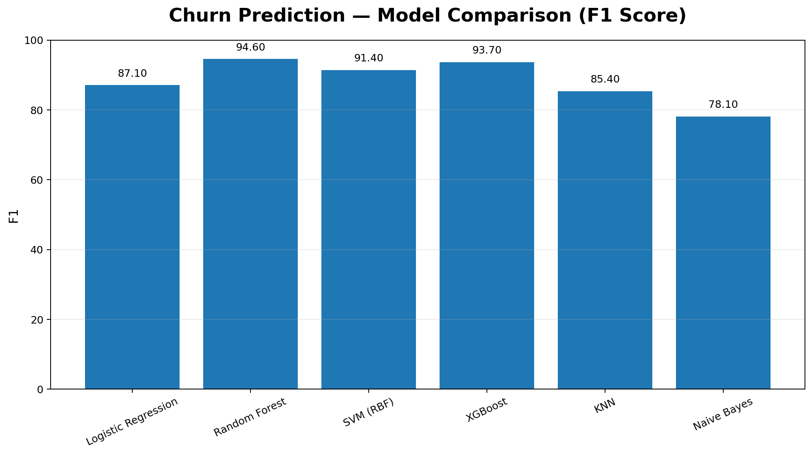
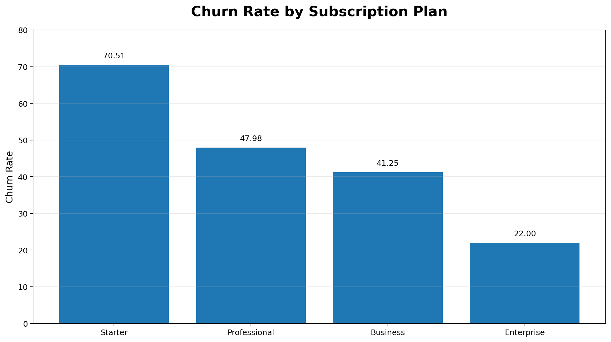
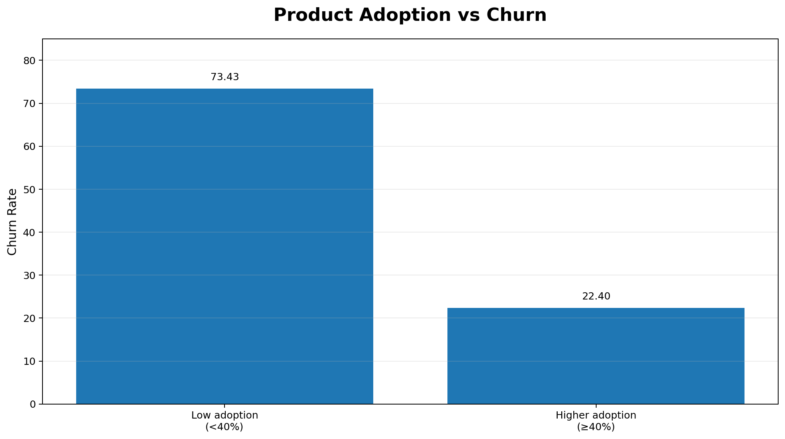
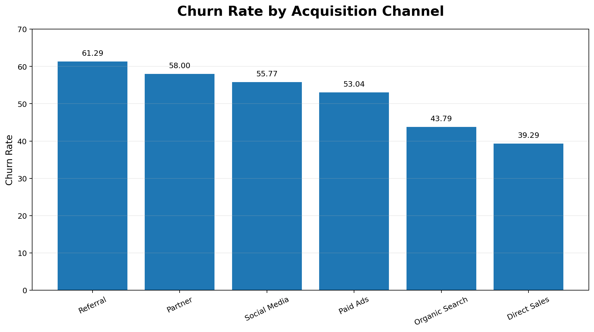
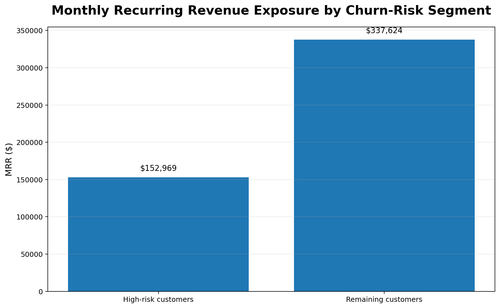

# Visual Analysis

The following visuals summarise the main analytical findings from the churn and revenue analysis.

## 1. Churn Prediction Model Comparison

The logistic-regression, Random Forest, SVM, XGBoost, KNN and Naive Bayes models are compared using F1 score. Random Forest achieved the strongest reported F1 score at **85.35%** in the held-out evaluation.

## 2. Churn by Subscription Plan

The **Starter** plan has the highest observed churn rate at **70.51%**, while **Enterprise** has the lowest at **22.00%**.

## 3. Product Adoption and Churn

Customers with low product adoption (<40% feature usage) recorded **73.43% churn**, compared with **22.40%** among customers with ≥40% feature usage.

## 4. Acquisition Channel and Churn

Observed churn varies across acquisition channels. Referral customers recorded **61.29% churn**, while Direct Sales recorded **39.29%**.

## 5. MRR Exposure by Churn Risk

The churn model classified **275 of 600 customers (45.83%)** as high risk. These customers represented **$152,968.85 in MRR**, or **31.18% of total MRR**.

This is best interpreted as **MRR exposure held by high-risk customers**, not guaranteed revenue loss.

